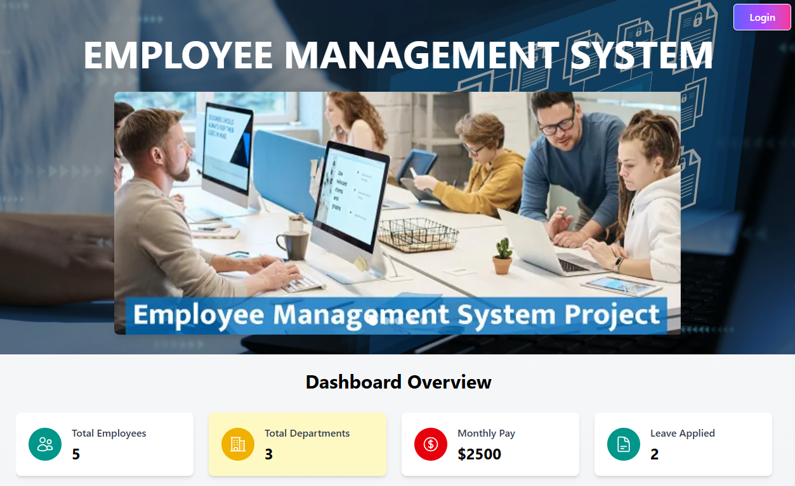
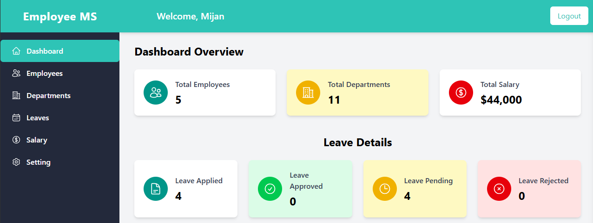
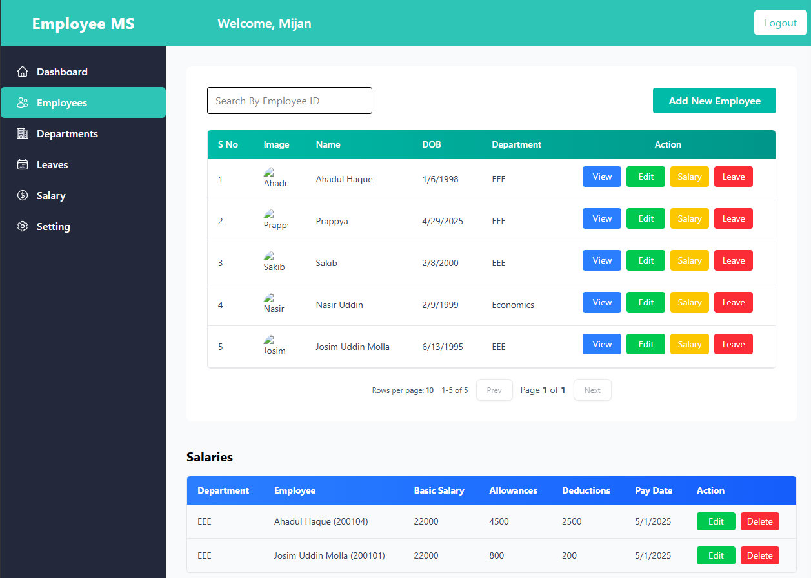
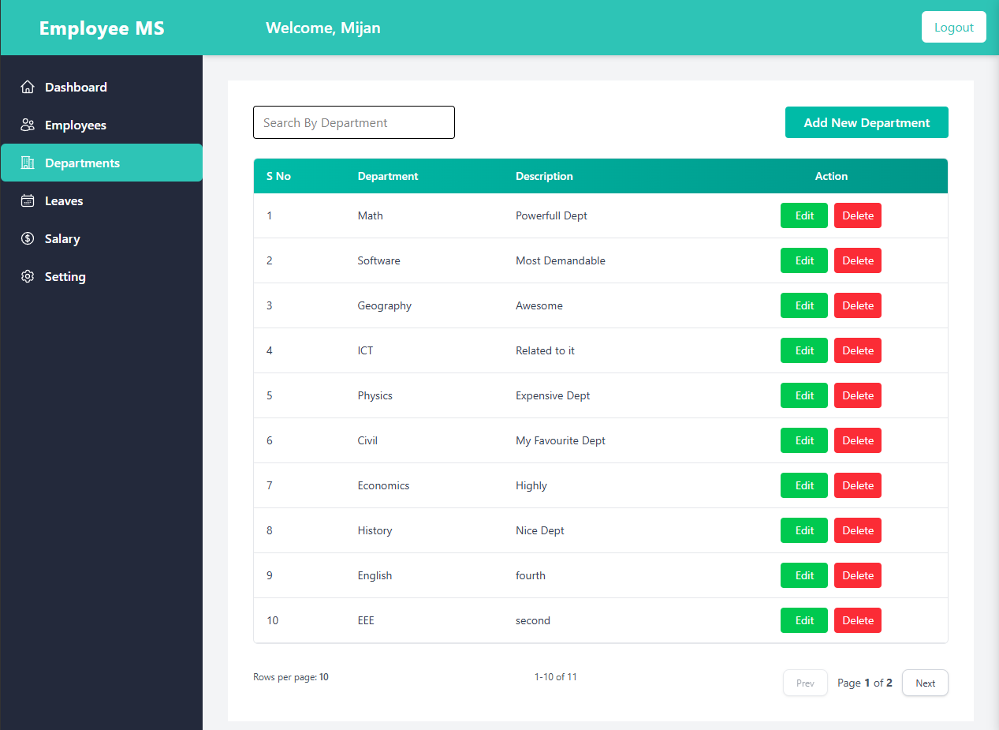
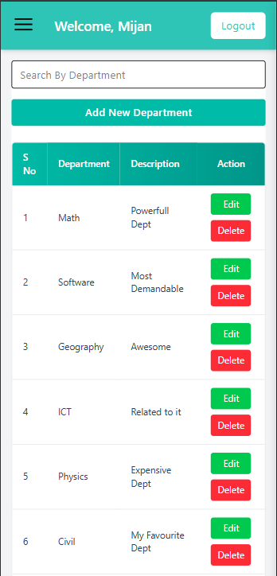

# Employee-Management
A modern full-stack web application designed to efficiently manage employee information using current technologies and best development practices.
## Project Photo







## Features

-   **User Authentication**

    -   Secure login and registration system
    -   JWT-based authentication
    -   Role-based access control

-   **Employee Management**

    -   Add, edit, and delete employee records
    -   View detailed employee information
    -   Upload and manage employee documents
    -   Profile image management with Cloudinary integration

-   **Modern UI/UX**
    -   Responsive design using Tailwind CSS
    -   Interactive data tables
    -   Toast notifications for user feedback
    -   Beautiful icons and components

## Tech Stack

### Frontend

-   React 19, Vite, Tailwind CSS, React Toastify, Hero Icons & Lucide React

### Backend

-   Node.js, Express.js, MongoDB with Mongoose, JWT Authentication, Bcrypt, Multer, Cloudinary, CORS enabled

## Getting Started

### Prerequisites

-   Node.js
-   MongoDB
-   Cloudinary account

### Installation


1. Install Backend Dependencies

```bash
cd backend
npm install
```

2. Install Frontend Dependencies

```bash
cd ../frontend
npm install
```

3. Environment Setup
    - Create `.env` file in the backend directory
    - Add the following variables:
        ```
        PORT=5000
        MONGODB_URI=your_mongodb_uri
        JWT_SECRET=your_jwt_secret
        CLOUDINARY_CLOUD_NAME=your_cloud_name
        CLOUDINARY_API_KEY=your_api_key
        CLOUDINARY_API_SECRET=your_api_secret
        ```

### Running the Application

1. Start the Backend Server

```bash
cd backend
npm run dev
```

2. Start the Frontend Development Server

```bash
cd frontend
npm run dev
```

The application will be available at:

-   Frontend: http://localhost:5173
-   Backend: http://localhost:5000

## Project Structure

```
employee-management/
├── frontend/
│   ├── public/
│   ├── src/
│   │   ├── components/
│   │   ├── pages/
│   │   ├── context/
│   │   ├── utils/
│   │   └── App.jsx
│   ├── package.json
│   └── vite.config.js
│
├── backend/
│   ├── controllers/
│   ├── models/
│   ├── routes/
│   ├── middleware/
│   ├── utils/
│   ├── uploads/
│   └── index.js
│
└── README.md
```

## Security Features

-   Password hashing using bcrypt
-   JWT token-based authentication
-   Protected routes
-   Secure file upload handling
-   Environment variable protection

## Development

-   ESLint for code linting
-   Vite for fast development and building
-   Hot module replacement
-   Modern ES modules

## Key Challenges & Solutions

### 1. Authentication & Authorization

**Challenge:** Implementing secure user authentication and role-based access control
**Solution:**

-   Implemented JWT-based authentication with refresh tokens
-   Created middleware for role verification
-   Used bcrypt for password hashing
-   Implemented token expiration and secure storage

### 2. File Upload & Storage

**Challenge:** Managing employee documents and profile images securely
**Solution:**

-   Integrated Cloudinary for image storage
-   Implemented Multer for file upload handling
-   Added file type validation and size restrictions
-   Created secure file access mechanisms

### 3. Real-time Updates

**Challenge:** Keeping the UI in sync with backend changes
**Solution:**

-   Implemented efficient state management
-   Used React Context for global state
-   Added optimistic updates for better UX
-   Implemented proper error handling and rollback mechanisms

### 4. Performance Optimization

**Challenge:** Handling large datasets and maintaining application performance
**Solution:**

-   Implemented pagination for data tables
-   Used lazy loading for images
-   Optimized database queries
-   Implemented proper indexing in MongoDB

## Future Enhancements in future

-   Employee performance metrics
-   Department-wise analytics - Attendance tracking
-   Salary analytics
-   React Native mobile app
-   Push notifications
-   Offline support
-   Mobile-specific features
-   Unit testing with Jest
-   Integration testing
-   E2E testing with Cypress
-   Performance testing
-   Code coverage reports
-   Email notification system
